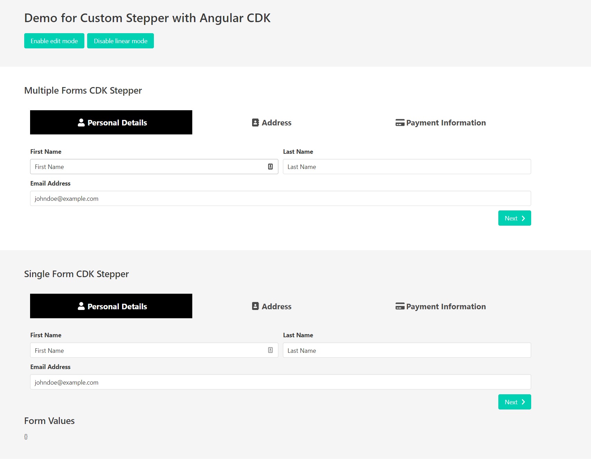

# NgCdkStepperFormsExample

You can find the accompanying article for this repo
[here](https://indepth.dev/building-a-custom-stepper-using-angular-cdk/) and the
demo [here](https://mainawycliffe.github.io/ng-cdk-stepper-example/).

